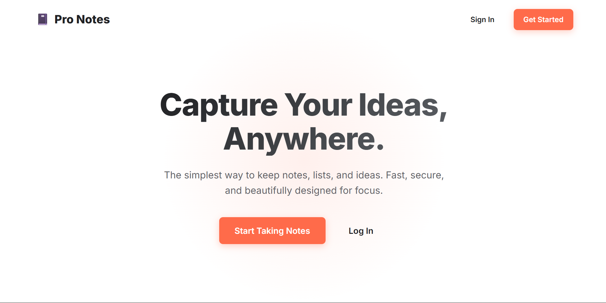
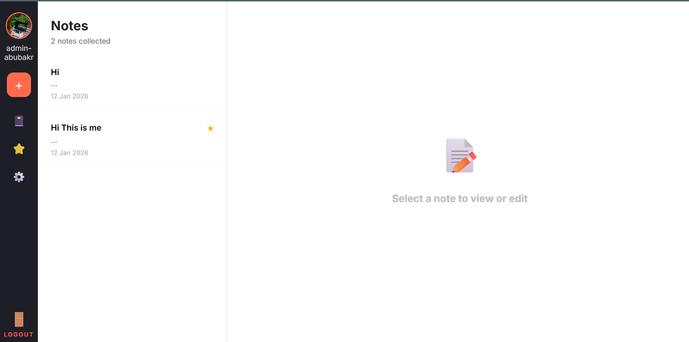
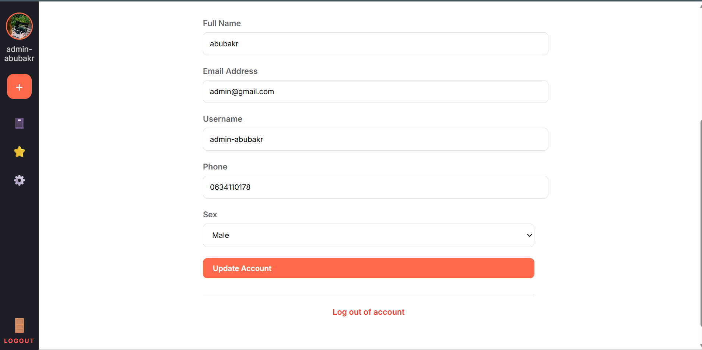
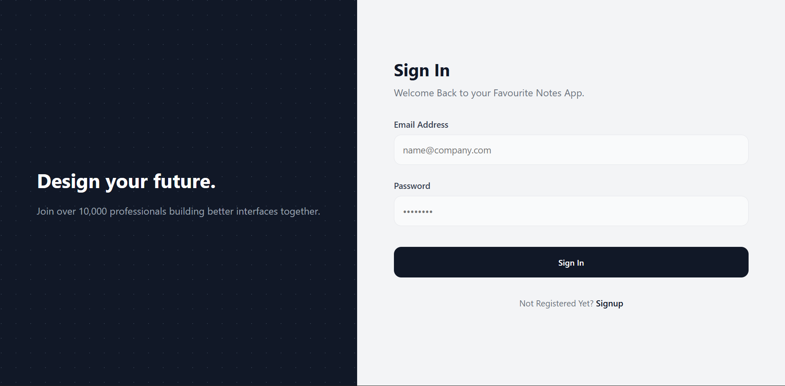
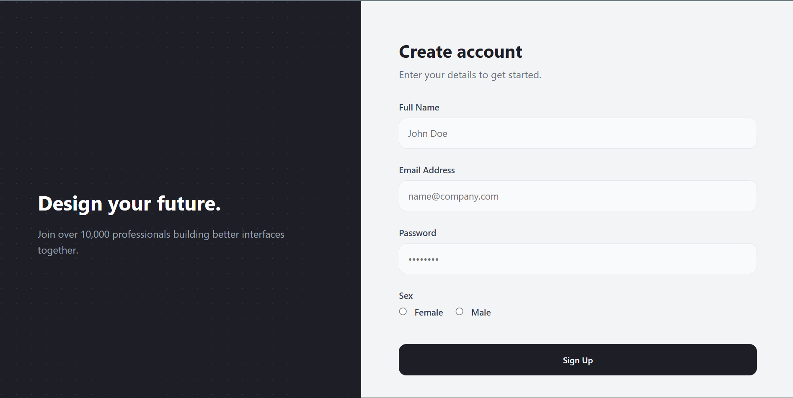

# Pro Notes

A clean, modern, and distraction-free note-taking application.

## Features

- **Rich Text Editing**: Simple and intuitive editor for your thoughts.
- **Favorites**: Star your most important notes for quick access.
- **Secure**: User authentication and session management.
- **Responsive**: Works great on desktop and mobile.
- **Modern Design**: Built with a focus on typography and usability.

## Getting Started

1. **Sign Up**: Create an account to get started.
2. **Create Note**: Click the `+` button to create a new note.
3. **Organize**: Star notes to keep them at the top.
4. **Settings**: customization your profile in the settings menu.

## Tech Stack

- **Frontend**: HTML5, CSS3 (Vanilla)
- **Backend**: PHP 8+
- **Database**: MySQL/MariaDB

## Installation

1. Import the database schema (if provided).
2. Configure `db.php` with your database credentials.
3. Serve the application using Apache/Nginx or PHP built-in server.

## Screenshots

### Landing Page

### Dashboard

### Edit Profile

### Sign In

### Sign Up

